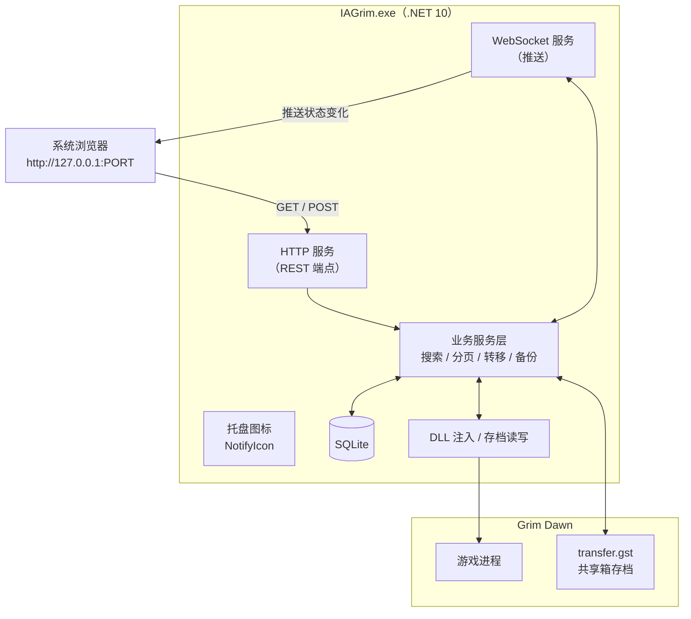

# 03 · 目标架构

> ★ **动手前必读。** 本文说明要改成什么样、为什么这么选。
> 改造前的系统见 [`02-现有架构.md`](./02-现有架构.md)。

---

## 1. 总体目标：从 A 到 B

```
【改造前】
IAGrim.exe
  ├── WinForms 主窗口（4 个标签页 + 搜索框 + 过滤器面板）
  └── WebView2（内嵌浏览器）→ 加载打包好的网页
      └── 通信靠 hostObjects + window.message（WebView2 私有机制）

【改造后】
IAGrim.exe（后台服务 + 托盘图标）
  ├── HTTP 服务（REST）      ← 浏览器请求数据
  ├── WebSocket 服务          → 主动推送状态变化
  ├── 托盘图标（NotifyIcon）  ← 唯一保留的 WinForms 组件
  └── （业务逻辑原封不动）

系统浏览器 → http://127.0.0.1:<PORT>
```

**一句话**：业务逻辑不动，**换外壳、换通信层、重做界面**。

---

## 2. 技术路线决策

### 2.1 候选路线

| 路线 | 做法 | 评价 |
|---|---|---|
| A | 维持现状（WebView2 加载打包页面） | ❌ 样式迭代要 build + 拷贝 + 重启，太慢 |
| B | WebView2 改为加载 Vite 开发服务器 | ⚠️ 能改善开发体验，但**前端仍受 WebView2 限制**，且要保留 WinForms |
| **C** | **后端提供本地 HTTP 服务，系统浏览器访问** | ✅ **已采纳** |
| D | 更换前端框架（当时在考虑） | ➡️ 已并入 C：既然重做，就换成 React |

### 2.2 为什么选 C

| 收益 | 说明 |
|---|---|
| **开发体验质变** | 完整浏览器 DevTools，改 CSS 即时生效 |
| **界面完全自由** | 不再受 WinForms 与 WebView2 的双重限制 |
| **环境解耦** | 前端可在任意系统开发，不受 Windows 约束 |
| **顺手消除两个问题** | 见 §8"范围界定" |
| **摆脱 WebView2 运行时依赖** | 用户不必再装 Evergreen Runtime |

**代价**：要写 HTTP/WebSocket 服务（C# 侧中等工作量）；
WinForms 的搜索框与过滤器面板要搬进网页（**这是最大的工作量**）。
→ 2026-09-12 现状：服务早已落地；**过滤面板的后端部分也已完成**（见 §4.5.1 / §4.5.2），
剩下的确实只是那个面板的 UI 本身。

### 2.3 ★ 一个关键技术事实

现有代码这样把 C# 对象交给前端：

```csharp
BrowserControl.CoreWebView2.AddHostObjectToScript("core", bindable);
```

`AddHostObjectToScript` 注入的对象**对 WebView2 中加载的任何 origin 都可用**
（代码没有设置 `AreHostObjectsAllowed`，默认允许）。

**推论**：即使不改架构，把页面地址换成 `http://localhost:3000` 也能工作。
这条事实说明「通信层能迁移」没有技术障碍——最终我们选择了更彻底的方案 C。

---

## 3. 目标架构



---

## 4. 通信协议设计

### 4.1 为什么需要两种机制

| 需求 | 机制 | 原因 |
|---|---|---|
| 前端**主动要**数据（搜索、翻页、转移） | **REST** | 请求-响应，语义清晰，好调试 |
| 后端**主动通知**（同步进度、属性加载完成） | **WebSocket** | 后端先知道的事，靠前端轮询做不到实时 |

### 4.2 REST 接口（已落地清单）

> ⚠️ 早期版本这张表是**从 `JavascriptIntegration.cs` 映射出来的草案**。那个类
> （WebView2 的 host object 桥）已经随 WebView2 一起删除，所以表里几项
> **永久不需要**了。下表按 2026-09-12 的实际状态重写。

| 方法 | 端点 | 状态 |
|---|---|---|
| `GET` | `/api/health` | ✅ 含 `maintenance` 与维护任务状态 |
| `GET` | `/api/items?offset=&limit=` | ✅ 对应原 `RequestMoreItems()` |
| `POST` | `/api/search` | ✅ 请求体结构见 §4.5 |
| `POST` | `/api/items/transfer` | ✅ **写操作**；见 §4.6 的数据形状说明 |
| `GET` | `/api/i18n` | ✅ 对应原 `GetTranslationStrings()` |
| `GET`/`POST` | `/api/settings` | ✅ 读 / 增量写 |
| `POST` | `/api/settings/reset` | ✅ 重置前先备份设置文件 |
| `GET` | `/api/settings/export` | ✅ 浏览器直接下载 |
| `POST` | `/api/settings/import` | ✅ 请求体传 JSON（避免 multipart） |
| `POST` | `/api/open/{backups,logs}` | ✅ 打开目录 |
| `GET` | `/ws` | ✅ WebSocket，见 §4.3 |
| `GET` | `/api/maintenance/status` | ✅ 维护任务状态（含进度），供页面刷新后恢复 |
| `POST` | `/api/maintenance/load` | ✅ **写操作**：加载游戏数据库（分钟级，立即返回） |
| `POST` | `/api/maintenance/clean` | ✅ **写操作**：清空游戏数据。⚠️ **网页无入口**（它做的事「加载数据库」第一步就做了），端点保留备用 |
| `POST` | `/api/maintenance/clear-cache` | ✅ 重算所有物品属性（旧界面叫 Clear cache） |
| `GET` | `/api/grimdawn/installs` | ✅ 已检测到的游戏安装 |
| `GET` | `/api/grimdawn/mods` | ✅ 已安装的 mod |
| `POST` | `/api/grimdawn/configure` | ✅ 手工指定安装目录（**收路径字符串**，浏览器开不了原生文件夹选择器） |
| `GET` | `/api/filters/options` | ✅ 过滤器面板的可选项（品质 / 槽位 / 职业 / 比较符 / 分组复选框 / 属性下拉）——见 §4.5 |

**永久不需要的**（`JavascriptIntegration` 已删除）：

| 端点 | 原用途 | 为什么不要了 |
|---|---|---|
| `/api/collection` | 图鉴页 | 2026-09-12 决定不做图鉴页 |
| `/api/set-associations` | 套装关联 | 旧前端的工具提示用；将来真要做"按套装过滤"再另议 |
| `/api/characters`、`/api/characters/{name}/download-url` | 角色备份页 | 依赖原作者的云服务，已决定不用 |
| `/api/settings/numeric-filter-banner/dismiss` | 数字过滤介绍横幅 | 那个弹窗仍留在 WinForms 侧 |

**不再需要的两个**（改用浏览器原生能力）：

| 原方法 | 替代 |
|---|---|
| `SetClipboard(text)` | 浏览器 `navigator.clipboard` |
| `OpenURL(url)` | `window.open()` |

> **`SignalReady()` 也不需要端点**：WebSocket 连接建立即代表前端就绪。
>
> 现状与安全机制见 [`04-开发环境.md`](./04-开发环境.md) §9。
> `tools/devapi` 已**退役**（`04` §8）。

### 4.3 WebSocket 消息：只发轻量信号（2026-09-12 实际落地）

**原设计是「沿用现有 `IOMessage` 枚举，只换传输层」。做 B2 时推翻了这个前提**：

- 旧枚举（`IAGrim/UI/Misc/Protocol/IOMessageType.cs`）是喂给 **Preact 前端**的，
  而新前端是重写的 React，**从来没有消费过它**——它连 `core.SignalReady()`
  都不调（这正是 `CefBrowserHandler._isReadyUi` 永远为 `false`、
  消息队列只进不出的原因）。
- 沿用枚举**省不下任何工作量**，反而要把 `SetItems` 那种整份物品列表塞进推送。

所以实际协议是：**WS 只发"发生了什么"，数据仍然走 REST。**
实现见 `IAGrim/Http/WebSocketHub.cs`。

| 消息 | 含义 | 前端动作 |
|---|---|---|
| `{ "type": "itemsChanged" }` | 物品数据库变了（拾取 / 转移 / 重新解析 / `hideSkills` 变更） | 用当前搜索词与分页重查列表 |
| `{ "type": "maintenance", active, message, task, phase, percent, phaseNumber, phaseCount, error }` | 维护任务（加载数据库 / 重算属性）的进度。`active` 为 true 时后端会**拒绝查询**（503） | 整屏遮罩 + 进度条；`active` 转 false 后自动恢复 |
| `{ "type": "notification", message, level, helpUrl, fade }` | 后端主动要给使用者看的提示（对应 C# 的 `IUserFeedbackHandler.ShowMessage`） | 右下角弹出提示条 |

> 这样设计的额外好处：前端自己知道在看什么（搜索词、分页、视图），
> 后端不需要知道，也不必把数据推两遍。
>
> 旧枚举仍然服务于 `CefBrowserHandler` → 旧 WebView2 那条路径，
> **B5 删掉 WebView2 时一起消失**。它的 `type` 编号表见该文件的 git 历史。

### 4.4 需要新设计的部分

| 问题 | 说明 |
|---|---|
| **搜索请求的形状** | ✅ **已定义**（A3 完成）→ 见 §4.5 |
| **过滤选项** | ✅ **已完成**（2026-09-12）：`GET /api/filters/options` → 见 §4.5 |
| ~~**端口**~~ | ✅ **已定：固定 3031**（不是这里写的 42500），占用即报错 |
| ~~**安全**~~ | ✅ **已定：暂不加 token**，只监听 `127.0.0.1` |
| ~~**程序生命周期**~~ | ✅ **已定：托盘常驻**；双击托盘图标重开 web UI |
| ~~**断线重连**~~ | ✅ **已实现**：前端指数退避重连；断连期间回退到轮询（§4.3、`.docs/00-当前状态.md`） |

### 4.5 搜索请求的 JSON 结构（已定，2026-09-11）

字段**沿用 C# 的 `IAGrim/Database/Dto/ItemSearchRequest.cs`**，同名同义。
（这正是当初这么定的价值：从 `tools/devapi` 切到真实 C# 后端时前端一行都没改。）

```json
{
  "wildcard": "神话 面具",
  "minimumLevel": 0,
  "maximumLevel": 100,
  "rarity": "Epic",
  "rarities": ["Blue", "Epic"],
  "orderByLevel": false,
  "isHardcore": false,
  "socketedOnly": false,
  "slot": ["ArmorProtective_Head"],
  "statValueFilters": [
    { "fields": ["defensiveFire"], "operator": "GreaterOrEqual", "threshold": 30 }
  ],
  "offset": 0,
  "limit": 50
}
```

端点：`POST /api/search`。用 POST 只是因为过滤条件（数组/嵌套）放请求体里更自然，
**它仍然是只读查询**。

| 字段 | 含义 | 状态 |
|---|---|---|
| `wildcard` | 关键词。★ **空格视为多个关键词**：「神话 面具」→ `%神话%面具%`；★ 还会**按属性名匹配**（见下方） | ✅ |
| `minimumLevel` / `maximumLevel` | 等级区间 | ✅ |
| `rarity` / `prefixRarity` | 品质单值。⚠️ 值是数据库里的 `Yellow`/`Green`/`Blue`/`Epic`，**不是** `Legendary` | ✅ |
| `rarities` | 品质**多选**（数组）。仅表达"值"，表达不了"双稀有"那种"值 + 词缀数"的组合 | ✅ |
| `rarityConditions` | 品质条件（**组内是或**）：`[{ rarity, prefixRarity }]`。"双稀有"= `{ Green, 2 }` | ✅ |
| `recentHours` | 只看最近 N 小时内入库的物品；0 = 不限（界面给"五小时内 / 一天内 / 一周内 / 一月内"） | ✅ |
| `enchantedOnly` | 只看**装备被附魔过**的（`PlayerItem.EnchantmentRecord` 非空） | ✅ |
| `orderByLevel` | 排序：true = 按等级需求升序，false/缺省 = 按名字。**只是排序，不是过滤条件** | ✅ |
| `isHardcore` | 查普通仓库还是硬核仓库 | ✅ |
| `socketedOnly` / `duplicatesOnly` / `hasPetBonus` / `petBonuses` | 开关类 | ✅ |
| `slot` / `slotInverse` | 槽位过滤（`ArmorProtective_Head` …） | ✅ |
| `classes` | 职业过滤（`class01` …） | ✅ |
| `filters` | **属性存在性**过滤：`List<string[]>`，每组的字段命中任意一个即可 | ✅ |
| `statValueFilters` | **数值过滤**（如"火焰抗性 ≥ 30"），走预计算表 `ComputedItemStat` | ✅ |

> ⚠️ **一个容易搞错的语义**：`Mod` 与 `isHardcore` **不是"可选过滤"，而是结果集的前提**。
> C# 里 `Mod` 为空表示"**只看非 Mod 物品**"（不是"不过滤"），硬核同理。
> 依据是 `PlayerItemDaoImpl.SearchForItems`。
>
> 另外 `wildcard` 同时匹配物品名与共享仓库副本的文本（C# 原逻辑）。

### 4.5.1 ★ 搜索框也会按**属性名**匹配（2026-09-12）

搜「火焰抗性」要找出**带该属性的物品**，而不只是名字里含这几个字的。

- 关键词在后端解析成一组 stat 名（`Services/Filters/FilterCatalog.ResolveKeyword`），
  命中的物品**即使名字不含关键词**也会返回：SQL 上是
  `(名字 LIKE) OR PI.Id IN (按 stat 子查询)`。
- 解析来源有两个：**人工标签**（`iatag_ui_*`，如"抗性"+"火焰"）与
  **语言表里的同名属性模板**（`defensiveFire` → `{0}% 火焰抗性`）。
- 关键词按空格分词，**每个词都要命中同一段文本**（AND），命中的条目贡献的 stat 名取并集。
- ⚠️ 模板来源**排除了 `customtag_*` / `iatag_*` / `tag*`**：那些是"组合模板"
  （如 `{1} {3} 伤害`），key 不是真 stat 名，去掉占位符只剩"伤害"，会把使用者引到不存在的字段。
- 解析不出任何属性时（如搜人名/物品名）行为**与从前完全一致**。

### 4.5.2 `GET /api/filters/options` 的返回形状（2026-09-12 实测）

```json
{
  "qualities": [{ "value": "Epic", "label": "传奇", "prefixRarity": 0 },
                { "value": "Green", "label": "双稀有", "prefixRarity": 2 }],
  "slotGroups": [{
    "id": "armor", "label": "护甲",
    "items": [{ "value": "ArmorProtective_Head", "label": "头盔", "inverse": false }]
  }],
  "classes":   [{ "value": "class01", "label": "士兵" }],
  "operators": [{ "value": "GreaterOrEqual", "label": "≥" }],
  "groups": [{
    "id": "resistances", "labelTag": "iatag_ui_resistances", "label": "抗性",
    "items": [{
      "id": "resistFire", "labelTag": "iatag_ui_resistance_fire", "label": "火焰",
      "kind": "stat", "numeric": true,
      "fields": ["defensiveFire", "defensiveFireModifier", "defensiveSlowFire", "defensiveSlowFireModifier"]
    }]
  }],
  "stats": [{ "name": "defensiveFire", "template": "{0}% 火焰抗性", "label": "X% 火焰抗性" }]
}
```

- `kind`：`stat`（勾选 → `filters`；填了数值 → 再进 `statValueFilters`）
  或 `flag`（直接对应 `ItemSearchRequest` 上的布尔字段，字段名在 `flag` 里）。
- **分组定义是照搬旧 WinForms 面板的**（`IAGrim/UI/Filters/*.cs` → `Services/Filters/FilterCatalog.cs`）：
  前端不再自己抄一份"什么属性对应什么 stat 名"的映射，避免两边漂移。
- ⚠️ `stats` **只列已被后台预计算**的属性（否则数值过滤永远查不到东西）；
  槽位清单**写死在后端**（查库会混进 175 个非装备类别），分组、顺序与显示名都由使用者定过。
- `slotGroups` 里"物品"组的最后一项是**"所有物品"**（`value` 是哨兵 `__all_items__`）：
  它不是槽位，而是**排除全部装备槽位**（`slotInverse`），用来兜住分类的遗漏。
- 职业只有**十个基础职业**（`class01`–`class10`）：游戏数据里的组合职业（`class0102`）对筛选无意义。
- ⚠️ Minimal API 默认用 System.Text.Json，**不接受字符串枚举**：
  `"operator":"GreaterOrEqual"` 会 400 且响应体为空。已在 `WebServer.Start()` 打开枚举名支持。

### 4.6 ★ 两个后端的数据形状差异（2026-09-11 实测）

开发时前端连 `tools/devapi`（原型），"真正用起来"时连 C# 后端。
实测发现两者返回的 `IItem` **有几处形状不同**——原型虽然照着
`ItemHtmlWriter` 写，但复刻得并不完全准确：

| 字段 | devapi 原型 | C# 后端 | 前端/后端的处理 |
|---|---|---|---|
| `icon` | `items/gearhead/bitmaps/c216_head.tex`（取自数据库 bitmap 列） | `d014_focus.tex.png`（`PlayerHeldItem.Bitmap`，**已带 .png**） | **两个后端的 `/img` 端点都容错**：只在还没有 `.png` 时才补 |
| `slot` | `ArmorProtective_Head`（原始值） | `副手`（`SlotTranslator` **已翻译**） | `slotLabel()` 找不到标签时原样返回，所以两种都对 |
| `level` | `94`（整数） | `75.0`（C# float） | 前端 `model/format.ts` 的 `formatNumber()` 统一 |
| `param0` | `"3"`（字符串、已四舍五入） | `3.0`（数字） | 同上 |

**为什么不改 C# 去迁就原型**：`ItemHtmlWriter` 是 WebView2（旧前端）与 HTTP
**共用**的实现，改它会波及现有界面——违反「功能行为不能坏」。

**所以约定**：以 **C# 的形状为准**，前端做兼容；
两个后端的 `/img` 端点**都必须容错**（否则前端换后端时图标会全挂）。

---

## 5. 前端选型与结构

### 5.1 技术栈

| 层 | 选型 | 理由 |
|---|---|---|
| 框架 | **React 18+** | 教程与生态最丰富，初学者遇问题容易搜到答案 |
| 语言 | **TypeScript** | 类型能挡住大量低级错误 |
| 构建 | **Vite** | 保留：开发服务器 + 热更新 |
| 样式 | **CSS + CSS 变量**（暂不引入框架） | 现有 CSS 变量体系可复用；需要时再考虑 Tailwind |
| 状态管理 | 待定（先用 React 内置 Context） | 见 §9 |

> **为什么从 Preact 换成 React**：两者写法几乎一致，但 React 的资料量级大得多。
> 对以"学习"为目的的项目，这个差别很实际。

### 5.2 目录结构

```
WebUI/src/
├── main.tsx              应用入口
├── App.tsx               根组件（路由 + 全局状态）
│
├── api/                  ★ 通信层（替代 integration/）
│   ├── rest.ts           REST 客户端
│   ├── socket.ts         WebSocket 客户端（含断线重连）
│   ├── types.ts          接口的请求/响应类型
│   └── index.ts          统一出口
│
├── model/                ★ 领域模型（从 interfaces/ 搬过来）
│   ├── item.ts           IItem
│   ├── stats.ts          IStat
│   ├── collection.ts     ICollectionItem
│   └── enums.ts          IItemType、消息枚举
│
├── store/                全局状态
│   ├── useItems.ts
│   ├── useSettings.ts
│   └── useNotifications.ts
│
├── views/                ★ 物品展示视图（可切换）
│   ├── ViewSwitcher.tsx
│   ├── TableView/        分栏列表
│   ├── CompactCardView/  简洁卡片
│   └── LegacyCardView/   现有卡片流（兜底）
│
├── components/           通用组件
│   ├── ItemDetail/       ★ hover 详情面板
│   ├── SearchBar/
│   ├── FilterPanel/
│   └── ...
│
├── styles/               CSS 变量与全局样式
└── i18n/                 翻译
```

**旧文件处置**：`integration/`、`containers/`、`components/` 里的旧代码先留着（不引用），
新结构稳定后逐个删除。**git 保留历史，随时可查。**

---

## 6. 界面设计（P0）

### 6.1 总思路：视图切换

不做单一布局，而是**加一个视图切换选择框**，同一批搜索结果用不同风格呈现：

```
ItemContainer（数据与交互：分页、转移、排序——与视图无关）
    │
    ▼
ViewSwitcher（选择框 + 记住用户偏好）
    ├── ① 分栏列表 TableView
    ├── ② 简洁卡片 CompactCardView
    └── ③ 现有卡片流 LegacyCardView
```

**架构要求**：视图组件**只接收 `items` 与回调，自己不做数据获取**。
新增一种样式 = 新增一个组件 + 注册到切换器，**不动数据逻辑**。

### 6.2 三种视图

| # | 名称 | 形态 | 优势 | 成本 |
|---|---|---|---|---|
| ① | **分栏列表** | 表格式，每件一行，关键信息**分栏对齐** | 扫视与横向对比最强，**最适合"精确找装备"** | 低 |
| ② | **简洁卡片** | 图标 + 名称 + 属性 **tag** | 比列表活泼，**适合"快速浏览"** | 中 |
| ③ | **现有卡片流** | 与当前一致 | 兜底与对照 | 零（已存在） |

**待定**：分栏列表的列是固定还是可配置？"关键属性"如何自动判定？

### 6.3 hover 详情面板

三种视图都依赖"hover 看详情"。这是 ARPG 玩家的肌肉记忆，方向没问题，
但**载体需要单独设计**：

| 方案 | 优点 | 缺点 |
|---|---|---|
| 现有 `react-tooltip`（HTML 字符串） | 改动小 | **不能交互**（不能点/滚）；双绿 MI 20+ 条属性会溢出屏幕 |
| 跟随鼠标的浮动面板 | 直觉、贴近游戏体验 | 长内容仍受屏幕限制；移出即消失 |
| **点击固定的详情卡 / 侧栏** | 可交互、可滚动、可对比、可复制 | 占用固定屏幕空间 |
| **混合：hover 预览 + 点击固定** | 兼顾两者 | 实现略复杂 |

> **初步倾向**：hover 显示"简版"（核心属性），点击固定后显示"全版"。

**性能要求**：列表可能有上千件，快速划过时**必须复用同一个面板实例**（只换内容），
不能每次 hover 都新建 DOM。参考 `.docs/06-外部参考.md` 的 grimtools 分析。

---

## 7. 后端改造要点

| 任务 | 说明 | 难度 |
|---|---|---|
| 加 HTTP 服务 | `HttpListener` 或 Kestrel，监听 `127.0.0.1:<PORT>` | 中 |
| 加 WebSocket | 把 `SendMessage` 的实现从 `ExecuteScriptAsync` 换成 WebSocket 发送 | 中 |
| 提供静态文件 | 把 Vite 构建产物 serve 出去（现在由 WebView2 虚拟主机做） | 低 |
| 启动浏览器 | `Process.Start("http://127.0.0.1:<PORT>")` | 低 |
| 保留托盘 | `NotifyIcon`（保留最小 WinForms 引用，**不显示任何窗口**） | 低 |
| 去掉 WebView2 | 移除 `Microsoft.Web.WebView2` 引用与相关代码 | 低 |
| 移植 WinForms 界面 | 搜索框、过滤器面板搬进网页 | **高** |

> ★ **2026-09-12 现状**：这张表里的项**都已落地**。唯一还没做完的是"移植界面"里的
> **过滤器面板 UI**——而它的**后端**（`GET /api/filters/options`、按属性名搜索、
> 数值过滤）已经完成并实测，见 §4.5.1 / §4.5.2。

> **建议顺序**：先让 HTTP/WebSocket 与旧路径**并存**（程序照常能用），
> 验证通过后再删旧的。任何一步出问题都能退回去。

### 关于托盘图标

**唯一还需要 WinForms 的地方**。三种处理方式：

1. **保留对 WinForms 的最小引用，只用 `NotifyIcon`** ← 采用（最省事、最稳定）
2. 换第三方托盘库（如 `H.NotifyIcon`）
3. 不要托盘

> "用 WinForms 的一个控件"和"用 WinForms 做整个界面"是两回事。目标（不要 WinForms 界面）依然达成。

---

## 8. 范围界定：做什么，不做什么

### 8.1 要做

| 功能 | 优先级 |
|---|---|
| 物品列表 + 多种展示样式 | P0 |
| hover 查看详情 | P0 |
| 搜索与过滤 | P0 |
| 转移物品（取回） | P0 |
| 设置、暗色模式 | P1 |
| 收藏图鉴（Collections） | 待定 |
| 角色备份 | 待定 |

### 8.2 不做（原"隐藏清单"）

> 在"改造"方案里，这些功能需要在界面上隐藏入口。
> 在"重做"方案里，它们**根本不实现**就是隐藏了——不需要任何开关机制。

| 功能 | 原位置 | 决定 |
|---|---|---|
| Components（跳官网） | 网页导航 | ❌ 不做 |
| Discord（跳邀请链接） | 网页导航 | ❌ 不做 |
| Patreon（跳赞助页） | 网页导航 | ❌ 不做 |
| 帮助页 Help | 网页导航 | ❌ 不做（537 行代码，且仅英文） |
| 愚人节彩蛋 EasterEgg | 隐藏触发 | ❌ 不做 |
| 数值过滤引导条 NumericFilterBanner | 提示条 | ❌ 不做 |
| 首次使用引导 FirstRunHelpThingie | 提示条 | ⚠️ 待定（对首次使用有用） |
| Mod 过滤警告 ModFilterWarning | 提示条 | ⚠️ 保留（有实际信息价值） |
| 「复制到剪贴板」按钮 | 结果区 | ⚠️ 待定（用于发论坛） |

**Collections 页的注意点**：现有物品卡片的**套装 tooltip 依赖 `collectionItems` 数据**
（`App.tsx` 启动时会预取）。若不做该页，需要确认套装信息如何获取。

### 8.3 顺带消失的问题

| 原问题 | 为什么消失 |
|---|---|
| **P1 隐藏没用的功能** | 重做即"不实现"，见 §8.2 |
| **P2 美化 WinForms 控件** | 外壳整个去掉，只剩托盘图标 |
| 两层导航的混乱 | 只有网页一层 |
| WebView2 运行时依赖 | 不再需要安装 Evergreen Runtime |

> 这是"重做"相对于"改造"的额外收益：**很多问题不是被解决，而是被绕过了。**

---

## 9. 待定问题

| 问题 | 备注 |
|---|---|
| ⚠️ **状态管理方案** | React 内置 Context 够用吗？上千条物品时的重渲染性能？是否需要 Zustand/Jotai？倾向先不引入 |
| ✅ **C# HTTP 服务用什么** | **Kestrel**（2026-09-11 定）。用 `FrameworkReference` 引用，不加 NuGet 包；代价见 [`04-开发环境.md`](./04-开发环境.md) §9 |
| ✅ **端口策略** | **固定 `3031`**，被占用即报错——不做自动换端口，行为更可预期 |
| ✅ **是否需要认证 token** | **第一版不加**：只监听 `127.0.0.1`。B 线后期或真要分发时再评估 |
| ✅ **图鉴（Collections）页** | **已决策删除**（2026-09-12），前后端代码均已移除 |
| ✅ **视觉设计方向** | **已定（2026-09-12）：以游戏内实际观感为准、逐项校准** —— 色值对着游戏取，不搞"参考某站风格"；grimtools 只在具体实现上借鉴（如滚动条） |
| ⚠️ **旧前端代码何时删除** | |
| ⚠️ **"关键属性"的判定规则** | tag 与列表列都要用，需要定义 |
