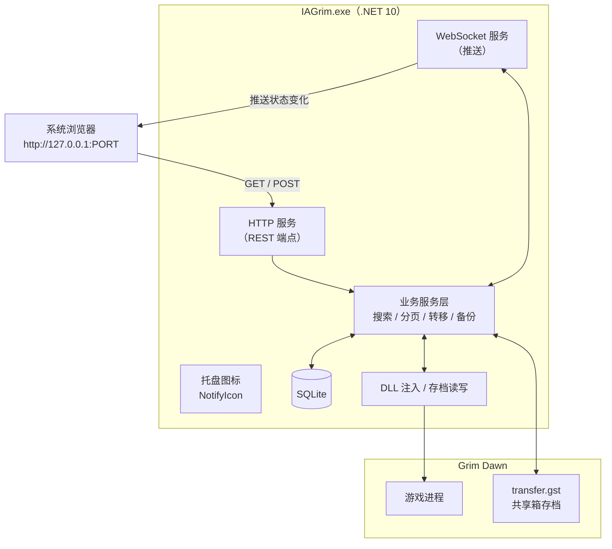

# 03 · 目标架构

> ★ **动手前必读。** 本文说明要改成什么样、为什么这么选。
> 改造前的系统见 [`02-现有架构.md`](./02-现有架构.md)。

---

## 1. 总体目标：从 A 到 B

```
【改造前】
IAGrim.exe
  ├── WinForms 主窗口（4 个标签页 + 搜索框 + 过滤器面板）
  └── WebView2（内嵌浏览器）→ 加载打包好的网页
      └── 通信靠 hostObjects + window.message（WebView2 私有机制）

【改造后】
IAGrim.exe（后台服务 + 托盘图标）
  ├── HTTP 服务（REST）      ← 浏览器请求数据
  ├── WebSocket 服务          → 主动推送状态变化
  ├── 托盘图标（NotifyIcon）  ← 唯一保留的 WinForms 组件
  └── （业务逻辑原封不动）

系统浏览器 → http://127.0.0.1:<PORT>
```

**一句话**：业务逻辑不动，**换外壳、换通信层、重做界面**。

---

## 2. 技术路线决策

### 2.1 候选路线

| 路线 | 做法 | 评价 |
|---|---|---|
| A | 维持现状（WebView2 加载打包页面） | ❌ 样式迭代要 build + 拷贝 + 重启，太慢 |
| B | WebView2 改为加载 Vite 开发服务器 | ⚠️ 能改善开发体验，但**前端仍受 WebView2 限制**，且要保留 WinForms |
| **C** | **后端提供本地 HTTP 服务，系统浏览器访问** | ✅ **已采纳** |
| D | 更换前端框架（当时在考虑） | ➡️ 已并入 C：既然重做，就换成 React |

### 2.2 为什么选 C

| 收益 | 说明 |
|---|---|
| **开发体验质变** | 完整浏览器 DevTools，改 CSS 即时生效 |
| **界面完全自由** | 不再受 WinForms 与 WebView2 的双重限制 |
| **环境解耦** | 前端可在任意系统开发，不受 Windows 约束 |
| **顺手消除两个问题** | 见 §8"范围界定" |
| **摆脱 WebView2 运行时依赖** | 用户不必再装 Evergreen Runtime |

**代价**：要写 HTTP/WebSocket 服务（C# 侧中等工作量）；
WinForms 的搜索框与过滤器面板要搬进网页（**这是最大的工作量**）。

### 2.3 ★ 一个关键技术事实

现有代码这样把 C# 对象交给前端：

```csharp
BrowserControl.CoreWebView2.AddHostObjectToScript("core", bindable);
```

`AddHostObjectToScript` 注入的对象**对 WebView2 中加载的任何 origin 都可用**
（代码没有设置 `AreHostObjectsAllowed`，默认允许）。

**推论**：即使不改架构，把页面地址换成 `http://localhost:3000` 也能工作。
这条事实说明「通信层能迁移」没有技术障碍——最终我们选择了更彻底的方案 C。

---

## 3. 目标架构



---

## 4. 通信协议设计

### 4.1 为什么需要两种机制

| 需求 | 机制 | 原因 |
|---|---|---|
| 前端**主动要**数据（搜索、翻页、转移） | **REST** | 请求-响应，语义清晰，好调试 |
| 后端**主动通知**（同步进度、属性加载完成） | **WebSocket** | 后端先知道的事，靠前端轮询做不到实时 |

### 4.2 REST 接口（草案）

由现有 `JavascriptIntegration.cs` 的方法映射而来，**语义保持一致**，只换传输层：

| 方法 | 端点 | 对应原方法 |
|---|---|---|
| `GET` | `/api/items?offset=&limit=` | `RequestMoreItems()` |
| `POST` | `/api/search` | 搜索（原来由 WinForms 搜索框驱动） |
| `POST` | `/api/items/transfer` | `TransferItem(id[], transferAll)` |
| `GET` | `/api/collection` | `RequestCollectionData()` ❌ **已删除**（2026-09-12 决定不做图鉴页） |
| `GET` | `/api/set-associations` | `GetItemSetAssociations()` |
| `GET` | `/api/characters` | `GetBackedUpCharacters()` |
| `GET` | `/api/characters/{name}/download-url` | `GetCharacterDownloadUrl()` |
| `GET` | `/api/i18n` | `GetTranslationStrings()` |
| `POST` | `/api/settings/numeric-filter-banner/dismiss` | `DismissNumericFilterBanner()` |
| `GET` | `/api/filters/options` | **新增**：可选的职业、品质、槽位、Mod 列表 |

> **实现状态（2026-09-12 核对 `IAGrim/Http/WebServer.cs`）**：
>
> - **已落地**：`/api/items`、`/api/search`、`/api/items/transfer`、`/api/i18n`，
>   另加了 `/api/health`、`/api/settings`(GET/POST)、`/api/settings/reset`、
>   `/api/settings/export`、`/api/settings/import`、`/api/open/{backups,logs}`。
> - **未落地**：`/api/set-associations`、`/api/characters`、
>   `/api/characters/{name}/download-url`、`/api/filters/options`（C2 过滤面板要用）。
> - `/api/collection` 随图鉴页一起删除。
> - `/api/items/transfer` 与 `/api/settings/*` 是**写操作**。
>
> ⚠️ `/api/items/transfer` 曾经"文档里有、代码里没有"——线 A 的转移是实现在
> `tools/devapi` 那个 Node 原型里的，新前端上线后一直 404。**改动端点表时请顺带核对代码。**
>
> 现状与安全机制见 [`04-开发环境.md`](./04-开发环境.md) §9。
> `tools/devapi` 已**退役**（`04` §8）。

**不再需要的两个**（改用浏览器原生能力）：

| 原方法 | 替代 |
|---|---|
| `SetClipboard(text)` | 浏览器 `navigator.clipboard` |
| `OpenURL(url)` | `window.open()` |

**`SignalReady()` 也不需要端点**：WebSocket 连接建立即代表前端就绪。

### 4.3 WebSocket 消息：沿用现有枚举

**关键设计**：消息格式保持 `{type, data}`，**类型编号与现在完全一致**。
这样 C# 侧构造消息的代码和前端处理消息的 `switch` 几乎原样保留。

| type | 名称 | 含义 |
|---|---|---|
| 0 | `ShowHelp` | 跳到帮助页 |
| 1 | `ShowMessage` | 通知条 |
| 2 | `ShowCharacterBackups` | 切到角色备份页 |
| 3 | `SetState` | 通用状态（暗色模式、加载中、首启动…） |
| 4 | `SetAggregateItemData` | 图鉴汇总 |
| 5 | `SetItems` | **搜索结果** |
| 6 | `SetCollectionItems` | 图鉴数据 |
| 7 | `ShowModFilterWarning` | Mod 过滤提示 |
| 8 | `UpdateCloudIconStatus` | 云备份图标更新 |
| 9 | `UpdateItemStats` | 物品属性延迟加载 |

> **设计原则**：**只换传输层，不改消息语义。** 这是风险最小的做法。

### 4.4 需要新设计的部分

| 问题 | 说明 |
|---|---|
| **搜索请求的形状** | ✅ **已定义**（A3 完成）→ 见 §4.5 |
| **过滤选项** | 前端需要知道可选的职业、品质、槽位、Mod 列表 → `GET /api/filters/options` |
| **端口** | 固定端口（如 `42500`）还是动态分配？固定更简单，但要处理占用 |
| **安全** | 只监听 `127.0.0.1`；是否需要 token 防止本机其他程序访问？ |
| **程序生命周期** | 浏览器关掉后程序继续运行（托盘常驻）；退出入口放托盘还是网页？ |
| **断线重连** | WebSocket 断开后前端要自动重连；重连后需要重新同步状态 |

### 4.5 搜索请求的 JSON 结构（已定，2026-09-11）

字段**沿用 C# 的 `IAGrim/Database/Dto/ItemSearchRequest.cs`**，同名同义——
将来把 `tools/devapi` 换成真正的 C# 后端时，前端一行都不用改。

```json
{
  "wildcard": "神话 面具",
  "minimumLevel": 0,
  "maximumLevel": 100,
  "rarity": "Legendary",
  "isHardcore": false,
  "socketedOnly": false,
  "offset": 0,
  "limit": 50
}
```

端点：`POST /api/search`。用 POST 只是因为过滤条件（数组/嵌套）放请求体里更自然，
**它仍然是只读查询**。

| 字段 | 含义 | devapi 状态 |
|---|---|---|
| `wildcard` | 关键词。★ **空格视为多个关键词**：「神话 面具」→ `%神话%面具%` | ✅ |
| `minimumLevel` / `maximumLevel` | 等级区间 | ✅ |
| `rarity` | 品质，如 `Legendary` / `Epic` | ✅ |
| `isHardcore` | 查普通仓库还是硬核仓库 | ✅ |
| `socketedOnly` | 只看带镶嵌物的 | ✅ |
| `slot` / `slotInverse` | 槽位过滤 | ⬜ 结构已定，未实现 |
| `classes` | 职业过滤 | ⬜ 同上 |
| `statValueFilters` | 数值过滤（如"火焰伤害 ≥ 30"） | ⬜ 同上 |
| `duplicatesOnly` / `hasPetBonus` / `filters` … | 见 C# DTO | ⬜ 同上 |

> ⚠️ **一个容易搞错的语义**：`Mod` 与 `isHardcore` **不是"可选过滤"，而是结果集的前提**。
> C# 里 `Mod` 为空表示"**只看非 Mod 物品**"（不是"不过滤"），硬核同理。
> 依据是 `PlayerItemDaoImpl.SearchForItems`，devapi 已复刻这两条。
>
> 另外 `wildcard` 同时匹配物品名与共享仓库副本的文本（C# 原逻辑）。
> devapi 目前只匹配物品名，⚠️ 待补。

**过滤选项** `GET /api/filters/options` 也已实现，返回可选的槽位与品质列表。

### 4.6 ★ 两个后端的数据形状差异（2026-09-11 实测）

开发时前端连 `tools/devapi`（原型），"真正用起来"时连 C# 后端。
实测发现两者返回的 `IItem` **有几处形状不同**——原型虽然照着
`ItemHtmlWriter` 写，但复刻得并不完全准确：

| 字段 | devapi 原型 | C# 后端 | 前端/后端的处理 |
|---|---|---|---|
| `icon` | `items/gearhead/bitmaps/c216_head.tex`（取自数据库 bitmap 列） | `d014_focus.tex.png`（`PlayerHeldItem.Bitmap`，**已带 .png**） | **两个后端的 `/img` 端点都容错**：只在还没有 `.png` 时才补 |
| `slot` | `ArmorProtective_Head`（原始值） | `副手`（`SlotTranslator` **已翻译**） | `slotLabel()` 找不到标签时原样返回，所以两种都对 |
| `level` | `94`（整数） | `75.0`（C# float） | 前端 `model/format.ts` 的 `formatNumber()` 统一 |
| `param0` | `"3"`（字符串、已四舍五入） | `3.0`（数字） | 同上 |

**为什么不改 C# 去迁就原型**：`ItemHtmlWriter` 是 WebView2（旧前端）与 HTTP
**共用**的实现，改它会波及现有界面——违反「功能行为不能坏」。

**所以约定**：以 **C# 的形状为准**，前端做兼容；
两个后端的 `/img` 端点**都必须容错**（否则前端换后端时图标会全挂）。

---

## 5. 前端选型与结构

### 5.1 技术栈

| 层 | 选型 | 理由 |
|---|---|---|
| 框架 | **React 18+** | 教程与生态最丰富，初学者遇问题容易搜到答案 |
| 语言 | **TypeScript** | 类型能挡住大量低级错误 |
| 构建 | **Vite** | 保留：开发服务器 + 热更新 |
| 样式 | **CSS + CSS 变量**（暂不引入框架） | 现有 CSS 变量体系可复用；需要时再考虑 Tailwind |
| 状态管理 | 待定（先用 React 内置 Context） | 见 §9 |

> **为什么从 Preact 换成 React**：两者写法几乎一致，但 React 的资料量级大得多。
> 对以"学习"为目的的项目，这个差别很实际。

### 5.2 目录结构

```
WebUI/src/
├── main.tsx              应用入口
├── App.tsx               根组件（路由 + 全局状态）
│
├── api/                  ★ 通信层（替代 integration/）
│   ├── rest.ts           REST 客户端
│   ├── socket.ts         WebSocket 客户端（含断线重连）
│   ├── types.ts          接口的请求/响应类型
│   └── index.ts          统一出口
│
├── model/                ★ 领域模型（从 interfaces/ 搬过来）
│   ├── item.ts           IItem
│   ├── stats.ts          IStat
│   ├── collection.ts     ICollectionItem
│   └── enums.ts          IItemType、消息枚举
│
├── store/                全局状态
│   ├── useItems.ts
│   ├── useSettings.ts
│   └── useNotifications.ts
│
├── views/                ★ 物品展示视图（可切换）
│   ├── ViewSwitcher.tsx
│   ├── TableView/        分栏列表
│   ├── CompactCardView/  简洁卡片
│   └── LegacyCardView/   现有卡片流（兜底）
│
├── components/           通用组件
│   ├── ItemDetail/       ★ hover 详情面板
│   ├── SearchBar/
│   ├── FilterPanel/
│   └── ...
│
├── styles/               CSS 变量与全局样式
└── i18n/                 翻译
```

**旧文件处置**：`integration/`、`containers/`、`components/` 里的旧代码先留着（不引用），
新结构稳定后逐个删除。**git 保留历史，随时可查。**

---

## 6. 界面设计（P0）

### 6.1 总思路：视图切换

不做单一布局，而是**加一个视图切换选择框**，同一批搜索结果用不同风格呈现：

```
ItemContainer（数据与交互：分页、转移、排序——与视图无关）
    │
    ▼
ViewSwitcher（选择框 + 记住用户偏好）
    ├── ① 分栏列表 TableView
    ├── ② 简洁卡片 CompactCardView
    └── ③ 现有卡片流 LegacyCardView
```

**架构要求**：视图组件**只接收 `items` 与回调，自己不做数据获取**。
新增一种样式 = 新增一个组件 + 注册到切换器，**不动数据逻辑**。

### 6.2 三种视图

| # | 名称 | 形态 | 优势 | 成本 |
|---|---|---|---|---|
| ① | **分栏列表** | 表格式，每件一行，关键信息**分栏对齐** | 扫视与横向对比最强，**最适合"精确找装备"** | 低 |
| ② | **简洁卡片** | 图标 + 名称 + 属性 **tag** | 比列表活泼，**适合"快速浏览"** | 中 |
| ③ | **现有卡片流** | 与当前一致 | 兜底与对照 | 零（已存在） |

**待定**：分栏列表的列是固定还是可配置？"关键属性"如何自动判定？

### 6.3 hover 详情面板

三种视图都依赖"hover 看详情"。这是 ARPG 玩家的肌肉记忆，方向没问题，
但**载体需要单独设计**：

| 方案 | 优点 | 缺点 |
|---|---|---|
| 现有 `react-tooltip`（HTML 字符串） | 改动小 | **不能交互**（不能点/滚）；双绿 MI 20+ 条属性会溢出屏幕 |
| 跟随鼠标的浮动面板 | 直觉、贴近游戏体验 | 长内容仍受屏幕限制；移出即消失 |
| **点击固定的详情卡 / 侧栏** | 可交互、可滚动、可对比、可复制 | 占用固定屏幕空间 |
| **混合：hover 预览 + 点击固定** | 兼顾两者 | 实现略复杂 |

> **初步倾向**：hover 显示"简版"（核心属性），点击固定后显示"全版"。

**性能要求**：列表可能有上千件，快速划过时**必须复用同一个面板实例**（只换内容），
不能每次 hover 都新建 DOM。参考 `.docs/06-外部参考.md` 的 grimtools 分析。

---

## 7. 后端改造要点

| 任务 | 说明 | 难度 |
|---|---|---|
| 加 HTTP 服务 | `HttpListener` 或 Kestrel，监听 `127.0.0.1:<PORT>` | 中 |
| 加 WebSocket | 把 `SendMessage` 的实现从 `ExecuteScriptAsync` 换成 WebSocket 发送 | 中 |
| 提供静态文件 | 把 Vite 构建产物 serve 出去（现在由 WebView2 虚拟主机做） | 低 |
| 启动浏览器 | `Process.Start("http://127.0.0.1:<PORT>")` | 低 |
| 保留托盘 | `NotifyIcon`（保留最小 WinForms 引用，**不显示任何窗口**） | 低 |
| 去掉 WebView2 | 移除 `Microsoft.Web.WebView2` 引用与相关代码 | 低 |
| 移植 WinForms 界面 | 搜索框、过滤器面板搬进网页 | **高** |

> **建议顺序**：先让 HTTP/WebSocket 与旧路径**并存**（程序照常能用），
> 验证通过后再删旧的。任何一步出问题都能退回去。

### 关于托盘图标

**唯一还需要 WinForms 的地方**。三种处理方式：

1. **保留对 WinForms 的最小引用，只用 `NotifyIcon`** ← 采用（最省事、最稳定）
2. 换第三方托盘库（如 `H.NotifyIcon`）
3. 不要托盘

> "用 WinForms 的一个控件"和"用 WinForms 做整个界面"是两回事。目标（不要 WinForms 界面）依然达成。

---

## 8. 范围界定：做什么，不做什么

### 8.1 要做

| 功能 | 优先级 |
|---|---|
| 物品列表 + 多种展示样式 | P0 |
| hover 查看详情 | P0 |
| 搜索与过滤 | P0 |
| 转移物品（取回） | P0 |
| 设置、暗色模式 | P1 |
| 收藏图鉴（Collections） | 待定 |
| 角色备份 | 待定 |

### 8.2 不做（原"隐藏清单"）

> 在"改造"方案里，这些功能需要在界面上隐藏入口。
> 在"重做"方案里，它们**根本不实现**就是隐藏了——不需要任何开关机制。

| 功能 | 原位置 | 决定 |
|---|---|---|
| Components（跳官网） | 网页导航 | ❌ 不做 |
| Discord（跳邀请链接） | 网页导航 | ❌ 不做 |
| Patreon（跳赞助页） | 网页导航 | ❌ 不做 |
| 帮助页 Help | 网页导航 | ❌ 不做（537 行代码，且仅英文） |
| 愚人节彩蛋 EasterEgg | 隐藏触发 | ❌ 不做 |
| 数值过滤引导条 NumericFilterBanner | 提示条 | ❌ 不做 |
| 首次使用引导 FirstRunHelpThingie | 提示条 | ⚠️ 待定（对首次使用有用） |
| Mod 过滤警告 ModFilterWarning | 提示条 | ⚠️ 保留（有实际信息价值） |
| 「复制到剪贴板」按钮 | 结果区 | ⚠️ 待定（用于发论坛） |

**Collections 页的注意点**：现有物品卡片的**套装 tooltip 依赖 `collectionItems` 数据**
（`App.tsx` 启动时会预取）。若不做该页，需要确认套装信息如何获取。

### 8.3 顺带消失的问题

| 原问题 | 为什么消失 |
|---|---|
| **P1 隐藏没用的功能** | 重做即"不实现"，见 §8.2 |
| **P2 美化 WinForms 控件** | 外壳整个去掉，只剩托盘图标 |
| 两层导航的混乱 | 只有网页一层 |
| WebView2 运行时依赖 | 不再需要安装 Evergreen Runtime |

> 这是"重做"相对于"改造"的额外收益：**很多问题不是被解决，而是被绕过了。**

---

## 9. 待定问题

| 问题 | 备注 |
|---|---|
| ⚠️ **状态管理方案** | React 内置 Context 够用吗？上千条物品时的重渲染性能？是否需要 Zustand/Jotai？倾向先不引入 |
| ✅ **C# HTTP 服务用什么** | **Kestrel**（2026-09-11 定）。用 `FrameworkReference` 引用，不加 NuGet 包；代价见 [`04-开发环境.md`](./04-开发环境.md) §9 |
| ✅ **端口策略** | **固定 `3031`**，被占用即报错——不做自动换端口，行为更可预期 |
| ✅ **是否需要认证 token** | **第一版不加**：只监听 `127.0.0.1`。B 线后期或真要分发时再评估 |
| ⚠️ **Collections 页是否保留** | 涉及套装 tooltip 的数据来源 |
| ⚠️ **视觉设计方向** | 参考 grimtools 还是走游戏原生风格？是否要出设计稿 |
| ⚠️ **旧前端代码何时删除** | |
| ⚠️ **"关键属性"的判定规则** | tag 与列表列都要用，需要定义 |
