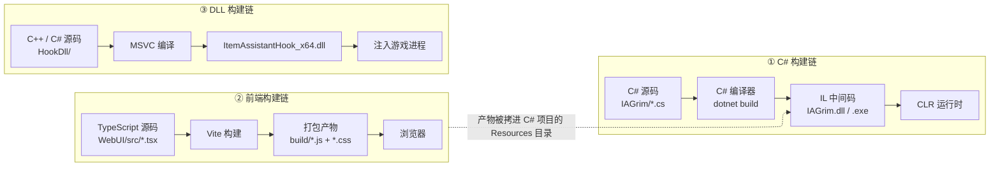
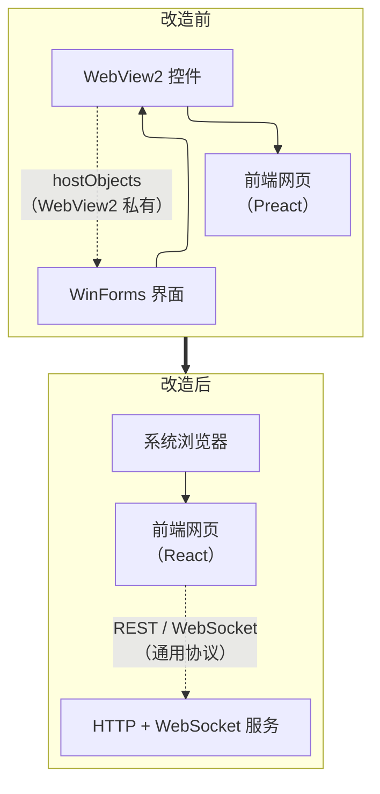
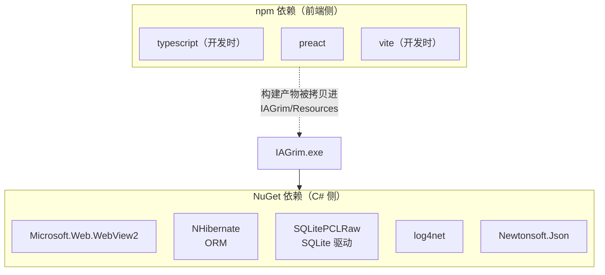
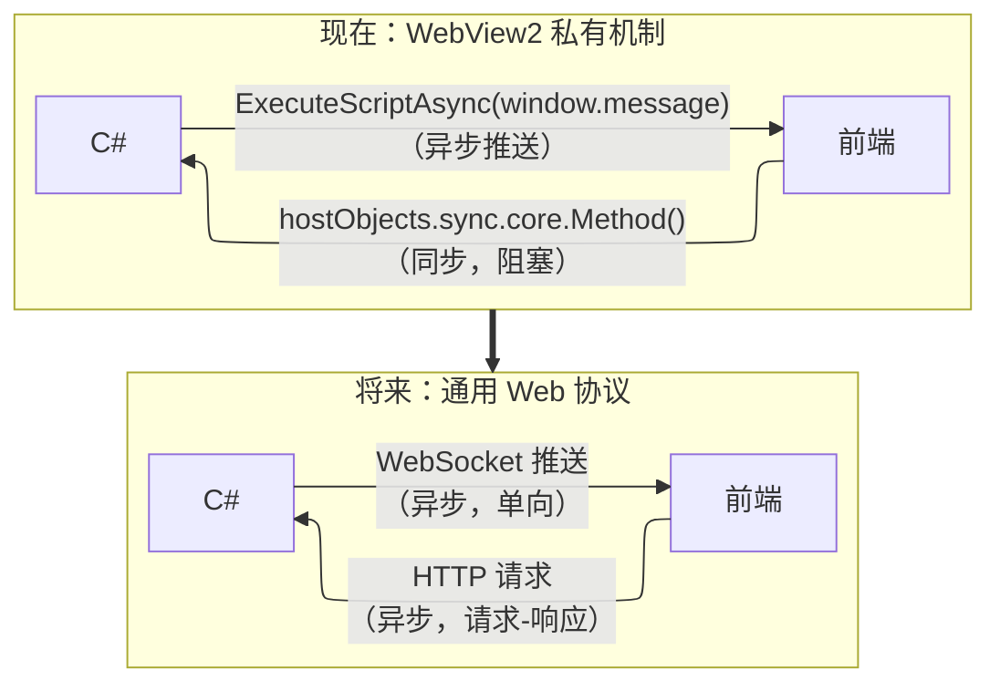

# 07 · 软件开发入门（以本项目为教材）

> 写给**没有软件开发经验**的人。所有概念都用本项目（IA）作为具体例子。
> 有 FPGA 背景的读者注意：文中会尽量给出与硬件的类比，但**类比只能帮助理解，不能替代**。
>
> 配套阅读：[`02-现有架构.md`](./02-现有架构.md)（现状）、[`03-目标架构.md`](./03-目标架构.md)（目标）。
> 本文回答"为什么"，那两篇回答"是什么"。

---

## 0. 怎么用这份文档

- 每节末尾有 **【在本项目里】**，指出对应的实际代码或文档。
- 第 7 节是**课后问题**，第 8 节是**调研任务**。建议先自己想，再看答案。
- 术语第一次出现时会**用一句话解释**，不假设你懂。
- 看不懂的地方可以直接问——文档不会因此变短，但你的理解会变深。

---

## 1. 一个程序是怎么从源码变成能跑的东西

### 1.1 三种运行方式

| 方式 | 例子 | 特点 |
|---|---|---|
| **编译型** | C、C++、Rust、Go | 源码 → 机器码，生成独立的可执行文件，运行快，但需要针对每个平台编译 |
| **带虚拟机的编译型** | C#、Java | 源码 → 中间码（IL / bytecode），运行时由虚拟机（.NET CLR / JVM）翻译执行 |
| **解释型** | Python、JavaScript | 源码在运行时逐行解释，不需编译，但慢 |

**C# 属于第二种**。编译产物不是机器码，而是 **IL（中间语言）**，
运行时由 **CLR（Common Language Runtime）** 翻译成机器码。

- 好处：跨平台、内存自动管理（垃圾回收）、类型安全。
- 本项目：目标是 `net10.0-windows`，即"用 .NET 10 的 CLR，且需要 Windows 专有 API"。

### 1.2 为什么还需要"构建"这回事

即使不编译，现代项目也很少只有源码文件。典型情况：

```
源码（人写的）
  ├── 需要翻译的：TypeScript → JavaScript、RTL → 网表
  ├── 需要打包的：几百个文件 → 一个文件
  ├── 需要优化的：压缩、去掉无用代码
  └── 需要处理资源的：图片、字体、图标
        ↓  构建（build）
产物（机器/浏览器能直接用的）
```

**构建 = 把"人写的东西"转换成"运行环境能直接用的东西"。**

### 1.3 本项目的三条构建链

这是本项目最需要理解的一张图——**三条完全独立的构建链**：



**关键理解**：

- 三条链**互不影响**，各自有各自的工具、依赖、产物。
- 但 ② 的产物**被 ① 打包进去**（`WebUI/build.cmd` 做的事情）。
- 所以改前端**只需要前端那条链**，不需要碰 C#。

> **在本项目里**：`02-现有架构.md` §2（C# 模块）、`04-开发环境.md` §3（构建流程）。

### 1.4 与 FPGA 的对比

| FPGA | 软件（前端为例） | 差异要点 |
|---|---|---|
| 写 Verilog / VHDL | 写 TypeScript / TSX | — |
| **仿真**（ModelSim） | **开发服务器**（`npm run dev`） | 都不产出最终产物；都为了快速迭代 |
| **综合 + 实现**（Vivado） | **构建**（`npm run build`） | 都产出最终产物；都慢；都做优化 |
| bitstream | `build/` 里的 JS/CSS | 都要下载/加载到目标设备 |
| FPGA 芯片 | 浏览器 | — |
| 时序约束 | 类型系统（TypeScript） | 都在"编译期"发现错误，而不是运行时 |
| IP 核 | 第三方库（npm 包） | 都是"别人做好的、拿去就用"的组件 |

**一个重要的不同**：

- FPGA 的仿真和综合处理的是**同一份源码**，但综合结果与仿真行为可能不一致（时序问题）。
- 前端的开发服务器和构建处理**同一份源码**，行为**几乎总是一致**（差异主要在压缩和优化）。

**另一个重要不同**：

- FPGA 里"改一行要重新综合 20 分钟"是常态。
- 前端有**热更新（HMR）**：改一行代码，浏览器里立刻生效，**不重启、不刷新**。
  这个能力极大影响开发效率，也是本项目要改架构的原因之一。

---

## 2. 架构：程序是怎么分块的

### 2.1 为什么必须分块

程序变大后，如果不分块，会变成"什么都知道、什么都改不动"的一坨。分块的目的：

| 目的 | 说明 |
|---|---|
| **控制复杂度** | 一次只需要理解一小块 |
| **隔离变化** | 改 A 不会影响 B |
| **可替换** | 换掉一块，其他不用动 |
| **可并行** | 多人（或多 AI）可以同时改不同块 |

### 2.2 分块的三种手段

| 手段 | 含义 | 类比（FPGA） |
|---|---|---|
| **模块（Module）** | 按职责把代码分组 | 一个 `.v` 文件里的一个 module |
| **接口（Interface）** | 模块对外的"合同"：能做什么，不暴露怎么做 | module 的端口列表 |
| **分层（Layer）** | 上层依赖下层，下层不知道上层 | 数据通路 + 控制器的层次 |

**最核心的原则**：**模块之间只通过接口交互，不伸手进别人内部。**

> 如果违反会怎样？FPGA 里如果一个模块直接去改别的模块的内部寄存器：
> 别人改了实现，你就崩了；你没法单独测试它；也没法替换它。
> 软件里完全一样。

### 2.3 本项目架构的演进



**这个演进在架构上的本质**：

| 维度 | 改造前 | 改造后 |
|---|---|---|
| 界面与逻辑的耦合 | **紧**：界面就是程序本身 | **松**：界面是独立进程 |
| 通信机制 | WebView2 私有（`hostObjects`） | 通用协议（HTTP/WebSocket） |
| 界面能否独立开发 | 不能，必须启动整个程序 | **能**，浏览器即可 |
| 换界面技术栈的成本 | 高（受 WebView2 限制） | 低（任何 Web 技术都行） |

> **在本项目里**：`02-现有架构.md` 全篇是"改造前"，`03-目标架构.md` 是"改造后"。

---

## 3. 技术栈全景与同类技术

### 3.1 什么是"技术栈"

一个问题可以有很多种解法。**技术栈 = 你为每一层选定的具体技术**。

```
┌─────────────────────────────────────────────┐
│ 语言        C# / TypeScript / C++ ...        │
├─────────────────────────────────────────────┤
│ 运行时      .NET CLR / Node.js / 浏览器      │
├─────────────────────────────────────────────┤
│ 框架        ASP.NET / React / WinForms ...   │
├─────────────────────────────────────────────┤
│ 构建工具    MSBuild / Vite / CMake ...       │
├─────────────────────────────────────────────┤
│ 包管理      NuGet / npm / ...                │
├─────────────────────────────────────────────┤
│ 数据存储    SQLite / PostgreSQL ...          │
├─────────────────────────────────────────────┤
│ 通信        HTTP / WebSocket / gRPC ...      │
└─────────────────────────────────────────────┘
```

**技术栈的选择不是"哪个最好"，而是"哪个最适合这个场景"。**
下面逐层看同类技术和本项目的选择。

### 3.2 后端语言

| 语言 | 优势 | 劣势 | 典型场景 |
|---|---|---|---|
| **C#** | 语法现代、工具链好、Windows 集成强 | 生态偏微软 | 桌面应用、企业后端、游戏（Unity） |
| Java | 生态最庞大、稳定 | 啰嗦、启动慢 | 大型企业系统、Android |
| Go | 部署简单（单文件）、并发好 | 表达能力弱、泛型新 | 云原生、网络服务、CLI |
| Python | 上手最快、库多 | 慢、类型弱 | 脚本、数据分析、AI |
| Node.js | 前后端同语言 | CPU 密集任务弱 | Web 服务、工具链 |
| Rust | 内存安全 + 高性能 | 学习曲线极陡 | 系统编程、性能关键 |

> **本项目为什么是 C#**：因为要**注入 DLL 到 Windows 游戏进程**、读写 Windows 文件系统、
> 与 Win32 API 打交道。这是 C#（配合 P/Invoke）的主场。**这不是一个可以自由选择的层。**

### 3.3 桌面界面框架

| 框架 | 技术 | 优势 | 劣势 |
|---|---|---|---|
| **WinForms** | C# | 最简单、控件多、稳定 | 观感老旧、布局能力弱 |
| WPF | C# + XAML | 矢量渲染、样式强大 | 学习曲线陡、内存占用高 |
| Electron | Web + Node | 前端技术直接复用 | 体积巨大（>100MB）、内存高 |
| Tauri | Web + Rust | 体积小、性能好 | 生态较新 |
| Qt | C++ / Python | 跨平台、性能好 | 授权复杂、C++ 门槛 |

> **本项目的情况**：现有外壳是 **WinForms**，观感老旧是使用者要改造的原因之一。
> 而我们的解法不是"换一个桌面框架"，而是**干脆不要桌面框架**——
> 用**浏览器**当界面。浏览器是全世界最成熟的渲染引擎，且调试工具最好。

### 3.4 前端框架

| 框架 | 特点 | 生态 | 学习曲线 |
|---|---|---|---|
| **React** | 事实标准，组件化，虚拟 DOM | ★★★★★ | 中 |
| Vue | 上手容易，中文资料多 | ★★★★ | 低 |
| Svelte | 编译期优化，无虚拟 DOM，代码少 | ★★★ | 低 |
| Angular | 全家桶，适合大型团队 | ★★★ | 高 |
| Preact | React 的 1/10 体积版，API 兼容 | ★★ | 低（同 React） |
| 原生 JS / jQuery | 不用框架，直接操作 DOM | — | 低（但项目大了会失控） |

> **本项目**：现有前端是 **Preact**，将改为 **React**。
> 理由不是技术优劣，而是**学习场景下资料量级差异巨大**——遇到问题时，搜到的答案大多是 React 的。

### 3.5 构建工具

| 工具 | 特点 |
|---|---|
| **Vite** | 极快的开发服务器（基于浏览器原生 ES 模块），现代项目首选 |
| Webpack | 老牌、功能最全、配置复杂，大项目常用 |
| esbuild / SWC | 极快的编译器，常被上面两者当作底层 |
| Parcel | 零配置 |

> **本项目用 Vite**：`npm run dev` 起开发服务器（热更新），`npm run build` 产出静态文件。

### 3.6 包管理器

| 生态 | 包管理器 | 依赖清单 | 依赖存放 |
|---|---|---|---|
| .NET | **NuGet** | `*.csproj` 里的 `<PackageReference>` | 全局缓存 |
| JavaScript | **npm** | `package.json` | `node_modules/` |
| Python | pip | `requirements.txt` / `pyproject.toml` | site-packages |
| Rust | Cargo | `Cargo.toml` | `target/` |

> **本项目两条链各有一个**：C# 侧用 NuGet，前端用 npm。**它们互不相关**，
> 这是初学者最容易混淆的地方之一。

### 3.7 数据存储

| 类型 | 例子 | 适用 |
|---|---|---|
| 嵌入式数据库 | **SQLite** | 单机应用，零配置，一个文件 |
| 客户端-服务器数据库 | PostgreSQL / MySQL | 多用户、网络访问 |
| 键值存储 | Redis | 缓存、会话 |
| 文件 | JSON / CSV | 简单配置、小数据 |

> **本项目用 SQLite**：单机应用，数据在一个文件里，无需安装数据库服务。
> 数据库里存的是使用者多年的装备收藏。

### 3.8 通信方式

见下一节，单独展开。

---

## 4. 依赖管理

### 4.1 三种"别人的代码"

| 类型 | 定义 | 本项目例子 |
|---|---|---|
| **库（Library）** | 你调用它 | `Newtonsoft.Json`（序列化） |
| **框架（Framework）** | 它调用你（控制反转） | React、WinForms |
| **工具（Tool）** | 构建时用，不进产物 | Vite、编译器 |

**"库 vs 框架"的核心区别是控制权在谁手里**：

- 用库：你的代码是主角，需要时叫库来帮忙。
- 用框架：框架是主角，它规定好流程，你在指定位置填代码（比如 React 的组件、WinForms 的事件处理函数）。

### 4.2 版本号与锁文件

版本号格式 `主版本.次版本.修订号`（语义化版本）：

```
  ^1.2.3   允许升级到 1.x.x（不跨主版本）
  ~1.2.3   允许升级到 1.2.x
  1.2.3    锁定这个版本
```

| 文件 | 作用 |
|---|---|
| `package.json` | 声明"我需要什么"，通常写宽松范围（`^1.2.3`） |
| `package-lock.json` | **锁定"实际装了什么"**，保证每次安装结果完全一致 |
| `*.csproj` | C# 侧的依赖声明 |
| `packages.lock.json` | C# 侧的锁文件（本项目未使用） |

> **锁文件为什么重要**：没有它，你和别人的 `npm install` 可能装到不同的小版本，
> 于是"在我机器上是好的"。这是软件工程里非常经典的一类问题。

### 4.3 本项目的依赖树



**注意**：前端依赖**不出现在最终程序里**——它们只在构建时使用，
最终程序拿到的是构建**产物**（纯 JS/CSS 文件）。

---

## 5. 进程间通信

### 5.1 为什么进程之间要通信

一个程序（进程）能做的事有限。当功能分散在多个进程时，它们必须交换信息：

| 场景 | 本项目 |
|---|---|
| 游戏进程 ↔ IA 主程序 | IA 需要知道"箱子开了没"，游戏需要被注入 DLL |
| 界面 ↔ 业务逻辑 | 界面要查数据、要触发操作 |
| 前后端（同机） | 现在是 WebView2 内嵌通信，将来是 HTTP/WebSocket |

### 5.2 几种通信方式对比

| 方式 | 速度 | 跨机器 | 复杂度 | 典型用途 |
|---|---|---|---|---|
| **函数调用** | 最快 | ❌ | 最低 | 同一进程内 |
| 共享内存 | 极快 | ❌ | 高 | 高性能数据传输 |
| 管道 / 命名管道 | 快 | ❌ | 中 | 父子进程 |
| **文件** | 慢 | ✅（共享盘） | 低 | 简单交换、存档 |
| Win32 消息 | 快 | ❌ | 中 | Windows 窗口间通知 |
| **TCP / HTTP** | 中 | ✅ | 中 | 通用网络接口 |
| **WebSocket** | 中 | ✅ | 中 | 需要服务端主动推送 |
| gRPC | 快 | ✅ | 高 | 微服务间的强类型调用 |
| 消息队列 | 中 | ✅ | 高 | 解耦、削峰、异步任务 |

> **类比 FPGA**：函数调用像**同一模块内的连线**；
> 进程间通信像**跨时钟域**——需要额外的握手、协议、缓冲，慢得多，也更容易出错。

### 5.3 本项目的通信全景

```mermaid
%%{init: {"flowchart": {"defaultRenderer": "elk"}} }%%
flowchart LR
    GD["Grim Dawn<br/>游戏进程"]
    HOOK["ItemAssistantHook.dll<br/>（注入进游戏）"]
    SAVE[("transfer.gst<br/>共享箱存档")]
    CORE["IAGrim 业务逻辑"]
    UI["界面"]

    GD --- HOOK
    HOOK -- "① Win32 消息<br/>箱子是否打开" --> CORE
    CORE <-- "② 读写文件<br/>物品搬运" --> SAVE
    SAVE --- GD
    CORE <-> "③ 通信层" <-> UI
```

三种通信方式、三种特性：

| # | 通道 | 方式 | 特点 |
|---|---|---|---|
| ① | 游戏 → IA | **Win32 消息** | 同机、单向、轻量通知 |
| ② | IA ↔ 存档 | **文件读写** | 最慢，但这是游戏本身的设计，无法绕过 |
| ③ | 逻辑 ↔ 界面 | **通信层** | ← **本项目要改造的就是这一条** |

### 5.4 通信层本身的演进



### 5.5 两个关键概念

#### 同步 vs 异步

| | 同步（blocking） | 异步（non-blocking） |
|---|---|---|
| 调用后 | **等**到有结果才继续 | 立刻返回，结果稍后给你 |
| 优点 | 写法简单、时序清晰 | 不卡界面、可并发 |
| 缺点 | **卡住整个线程** | 代码复杂（回调 / Promise / async-await） |
| 本项目 | 现有 `hostObjects.sync` 是同步的 | 改为 HTTP 后全部变异步 |

> **类比 FPGA**：同步调用像**阻塞式握手**——发起后必须等 `ready` 才能干别的。
> 异步像**非阻塞发送 + 完成中断**。

#### 请求-响应 vs 推送

| | 请求-响应（pull） | 推送（push） |
|---|---|---|
| 谁发起 | 客户端 | 服务端 |
| 适合 | "我要数据" | "有事情发生了" |
| 本项目 | REST：查物品、翻页、转移 | WebSocket：同步进度、属性加载完成 |

> **判断规则**：**谁是第一个知道这件事的人，就由谁发起。**
> 用户点击搜索 → 前端先知道 → 用 REST。
> 后台同步完成了一批物品 → C# 先知道 → 用 WebSocket。

---

## 6. 前端入门

### 6.1 浏览器里发生了什么

浏览器加载一个网页，大致做三件事：

```
HTML   → 描述"有什么"（结构）
CSS    → 描述"长什么样"（样式）
JS     → 描述"怎么动"（行为）
   ↓
浏览器把它们组合成一棵 DOM 树，再绘制到屏幕上
```

**DOM（Document Object Model）** = 网页在内存里的树状结构表示。
"改网页"本质上就是"改这棵树"。

### 6.2 为什么需要前端框架

直接用 JS 操作 DOM 的问题：

```js
// 想更新列表里的第 3 项数据
document.querySelector('#item-3 .name').textContent = newName;
document.querySelector('#item-3 .level').textContent = newLevel;
// ……还要记得更新所有相关的地方
```

数据一多就失控：**你必须在每个地方手动保证"数据和界面一致"**。

框架的解法是**声明式**：

```jsx
// 只描述"给定这个数据，界面应该长什么样"
function Item({item}) {
  return <div><span>{item.name}</span><span>{item.level}</span></div>;
}
```

**数据变了，框架自动算出差异并更新 DOM。** 这叫**响应式**。

> **类比 FPGA**：手写 DOM 操作像**手工展开所有逻辑**（改了就要全部重来）；
> 框架像**用 generate 写参数化代码**——你描述规则，工具生成实现。

### 6.3 组件与状态

| 概念 | 含义 | 本项目例子 |
|---|---|---|
| **组件（Component）** | 一块可复用的界面 + 它的逻辑 | `Item`（一张物品卡片） |
| **Props** | 父组件传给子组件的数据（**只读**） | `<Item item={...} />` |
| **State** | 组件自己管理的数据（**可改**） | 当前选中的视图样式 |
| **状态提升** | 把共享的 state 放到共同的父组件 | 物品列表放在 `App` 里 |

**关键原则：数据向下流（props），事件向上传（callback）。**

```
        App（持有 items 状态）
         │  ↓ items          ↑ onTransfer
         ▼                   │
     ItemContainer ──────────┘
         │  ↓ item           ↑ onTransfer
         ▼                   │
       Item ─────────────────┘
```

> **本项目**：`03-目标架构.md` §6 的"视图组件只接收 items 与回调，自己不做数据获取"，
> 就是为了强化这个结构——让视图成为**纯函数**：给同样的输入，画同样的界面。

### 6.4 为什么需要构建工具

浏览器**不认识** TypeScript 和 JSX。而且一个大项目有几百个源文件，
浏览器逐个加载会非常慢。

构建工具做两件事：

| 事 | 说明 |
|---|---|
| **翻译** | TypeScript → JavaScript、JSX → 函数调用 |
| **打包** | 几百个文件 → 少数几个文件，并压缩 |

而 **开发服务器**（Vite dev）是第三种模式：**不打包**，按浏览器的请求**即时翻译单个文件**。
所以启动快、改一行只需重编译那一个文件——这就是热更新的原理。

---

## 7. 课后问题

> 建议先自己回答，再回到项目里找证据。没有标准答案，重点是推理过程。

### 7.1 构建与依赖

1. 本项目有**三条独立的构建链**（C#、前端、DLL）。如果你只改前端代码，需要运行哪几条？
   如果把三条都跑一遍会有什么后果？
2. `package.json` 里写 `"preact": "^10.25.0"`，而 `package-lock.json` 里记录的是 `10.25.3`。
   这两份文件各自的作用是什么？删掉锁文件会出什么问题？
3. NuGet 和 npm 管的是完全不同的两批依赖。**为什么换个前端框架不需要动 C# 项目？**

### 7.2 架构

4. 现有系统里，前端通过 `chrome.webview.hostObjects` 调用 C#。
   这个机制**只有 WebView2 里有**。如果直接在浏览器打开网页会发生什么？为什么？
5. 改造后界面变成了"浏览器里的网页"，程序主体变成了"后台服务"。
   **这样划分之后，"界面"这块能不能被单独换掉？** 换成别人的实现需要改哪些地方？
6. 为什么文档反复强调"视图组件只接收 items 和回调，自己不做数据获取"？
   违反这条会导致什么问题？（提示：想想如果每个视图都自己发请求，切换视图时会怎样）

### 7.3 通信

7. 后端有两条路可以通知前端"有新物品了"：**让前端定时来问**（轮询），
   或者**后端主动推**（WebSocket）。各自的问题是什么？在什么情况下轮询是可以接受的？
8. 现有的 `hostObjects.sync.core.RequestMoreItems()` 是**同步**调用，
   改成 HTTP 后变成**异步**。前端 `App.tsx` 里"请求更多物品"的逻辑需要怎么改？
   （提示：现在的代码在调用后立刻假定会拿到数据吗？）
9. 如果 WebSocket 断开 30 秒后又恢复，前端在此期间可能错过了若干条 `SetItems` 消息。
   **恢复连接后应该做什么？** 只重连够不够？

### 7.4 数据与状态

10. 项目里所有 SQL 操作都跑在一个专门的线程上串行执行。
    **为什么？**（提示：查一下 SQLite 的并发限制）
11. 前端把 `UpdateItemStats` 消息攒 6 秒再批量应用，而不是收到就渲染。
    这个优化的前提是什么？如果改成立刻渲染，用户会看到什么现象？
12. 物品列表可能有一千条，但屏幕上只显示十几条。
    如果直接渲染全部一千个 DOM 节点会怎样？"虚拟滚动"是怎么解决的？

### 7.5 边界与权衡

13. 我们决定**保留 WinForms 的 `NotifyIcon`**（托盘图标）来做系统托盘，
    但同时又声称"不要 WinForms"。这两者矛盾吗？为什么？
14. grimtools 的 hover 面板效果很好，但它的代码**不能直接抄**。
    具体是什么原因？如果我们硬要抄，会遇到什么具体困难？
15. "重做前端"让原本的两个目标（隐藏没用的功能、美化 WinForms 控件）**自动消失**了。
    **这种"问题被绕过而不是被解决"的情况，在什么时候是好事，什么时候是坏事？**

---

## 8. 调研任务

> 每个任务都有明确产出。完成了就记进 `.docs/`，不要只留在脑子里。

### 8.1 前端方向

| # | 任务 | 产出 |
|---|---|---|
| 1 | 打开 <https://www.grimtools.com/db/>，按 F12 打开 DevTools，hover 一件装备，在 Elements 面板里找到它的详情面板。**记录它的 DOM 结构与类名组织方式** | 追加到 `.docs/06-外部参考.md` §1.3 |
| 2 | 用 React 写一个"计数器 + 列表"的小 Demo（不需要集成到项目里），理解 `useState` 和组件重渲染 | 可以直接说"做完了" |
| 3 | 查一下 React 的状态管理方案（Context / Zustand / Redux），**判断本项目上千条物品的场景需要哪种** | 结论写进 `.docs/03-目标架构.md` §9 |
| 4 | 研究虚拟滚动库（如 `react-window` / `@tanstack/react-virtual`），**评估本项目是否需要** | 同上 |

### 8.2 后端方向

| # | 任务 | 产出 |
|---|---|---|
| 5 | 查 `HttpListener` 与 Kestrel 的区别（依赖、性能、易用性），**判断本项目该用哪个** | 结论写进 `.docs/03-目标架构.md` §9 |
| 6 | 查 `HttpListener` 如何接受 WebSocket 连接（`AcceptWebSocketAsync`），写一个小 Demo | 结论同上 |
| 7 | 研究：如何在 .NET 程序里**只保留托盘图标而不显示窗口**（提示：`ApplicationContext` 而非 `Form`） | 记录实现方式 |
| 8 | 评估是否需要认证 token：**本机其他程序能否访问这个端口？风险是什么？** | 结论同上 |

### 8.3 数据方向

| # | 任务 | 产出 |
|---|---|---|
| 9 | 在数据库和代码里确认：**物品是否有"占几个格子"的尺寸数据**（决定将来能否做图标网格） | 结论写进 `.docs/06-外部参考.md` |
| 10 | 确认 **`collectionItems` 数据与套装 tooltip 的依赖关系**：如果不做 Collections 页，套装信息还能不能显示？ | 结论写进 `.docs/03-目标架构.md` §8.2 |
| 11 | 盘点现有前端的 5000 行代码：**哪些是"要重做的"、哪些是"可搬走的"、哪些是"可以直接删的"** | 产出清单 |

### 8.4 工具与环境

| # | 任务 | 产出 |
|---|---|---|
| 12 | 在 Windows 上验证 `dotnet build IAGrim-core.sln` **是否真的不需要 Visual Studio** | 更新 `.docs/04-开发环境.md` |
| 13 | 测量仓库放在 `C:\`（WSL2 通过 `/mnt/c` 访问）与放在 WSL2 内，`npm install` 的耗时差异 | 更新 `.docs/04-开发环境.md` §1.1 |
