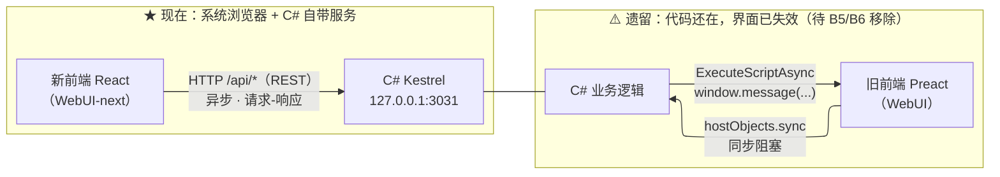

# AGENT.md — IAGD 工作指南

> 面向 AI 编码助手的**对话入口**。新对话读两份即可接上进度：
> **本文件**（稳定的工程背景）+ **[`.docs/00-当前状态.md`](./.docs/00-当前状态.md)**（易变的进度）。
>
> 详细设计内容在 `.docs/`，索引见 [`.docs/README.md`](./.docs/README.md)。

---

## 工程介绍

**iagd**（Grim Dawn Item Assistant）是 ARPG 游戏**恐怖黎明**的第三方工具，
给游戏外挂一个**无限容量的仓库**：把游戏共享箱里的物品"偷"进自己的 SQLite 数据库，
需要时再写回游戏。附带物品检索、收集图鉴、存档备份、好友共享。

### 项目定位

- 本仓库是 **Aa-arun（使用者本人）fork 出来自用魔改的版本**。
- **不必顾虑上游**：不需要兼容 `marius00/iagd`，不考虑 PR、向后兼容或上游代码风格。
- fork 后**尚未做实质改动**。`README.md` 描述的是老架构（CefSharp），是上游忘记更新。

### 使用者背景

- **FPGA 工程师**，熟练 VSCode / Linux，**没有软件开发经验**。
- 本项目兼具**学习软件开发**的目的：
  - 解释概念要从原理出发，术语顺手解释一句。
  - 不确定的地方直接说"不确定"，**不要编造**。
  - 配套教学文档：`.docs/07-教学-软件工程.md`（含课后问题与调研任务）。

### 目标

| 优先级 | 目标 | 状态 |
|---|---|---|
| **P0** | **重做装备显示界面**：提供多种可切换的展示样式 | 设计中 |
| ~~P1~~ | ~~隐藏没用的功能~~ | ✅ 重做即"不实现"，自动解决 |
| ~~P2~~ | ~~美化 WinForms 控件~~ | ✅ 外壳整个去掉，自动消失 |

### ★ 技术路线（已定，2026-09-11）

> **后端服务化 + 系统浏览器访问 + 前端用 React 重做，通信 REST + WebSocket。**
> **WinForms 外壳与 WebView2 最终全部去掉**，只保留托盘图标（`NotifyIcon`）。
>
> - 目标设计：**`.docs/03-目标架构.md`**
> - 实施步骤：**`.docs/05-实施计划.md`**

### 约束

1. **功能行为不能坏**（物品搬运、数据库、游戏解析的结果必须与现在一致），
   但**后端架构可以改**——这正是当前技术路线要做的。
2. **已有数据不能丢**：物品数据库是多年积累。
3. **每步改动都提交 git**，保证可回退。
4. 动手前先看 `.docs/` 对应文档，不要凭猜测改代码。

---

## 工程结构

```
iagd/
├── AGENT.md                 ← 本文件
├── .docs/                   ← ★ 全部设计文档（索引见 .docs/README.md）
├── README.md                ← 上游 README（描述过时：仍写 CefSharp）
├── LINUX.md                 ← 上游的 Linux 运行指南，**本项目用不到**
├── IAGrim-core.sln          ← Visual Studio 解决方案
│
├── IAGrim/                  ← 【主程序】WinForms 外壳 + 全部业务逻辑（.NET 10）
│   ├── Program.cs / StartupService.cs    进程入口与启动编排
│   ├── UI/                  ← WinForms 界面
│   │   ├── MainWindow.cs / .Designer.cs  主窗口（TabControl 外壳）
│   │   ├── Tabs/SplitSearchWindow.cs     ★ Items 页：左过滤面板 + 右 WebView2
│   │   ├── Misc/CEF/                     ★ 前后端桥（名字是历史遗留，实为 WebView2）
│   │   └── Filters/, Popups/, Controller/
│   ├── Database/            ← SQLite + NHibernate：DAO / Model / Dto / Migrations
│   ├── Parsers/             ← 解析游戏数据（Arz）与 transfer 存档
│   ├── Services/            ← 物品分页、属性计算、消息处理
│   └── Backup/, Utilities/
│
├── WebUI/                   ← 【旧前端】Preact + TS + Vite ⚠️ 已停用，待删（B5/B6）
│   ├── src/components/      ← 组件（App、Header、Item 卡片、提示条）
│   ├── src/containers/      ← 页面级容器（ItemContainer / Collection / Help…）
│   ├── src/integration/     ← 与 C# 通信的唯一出入口（hostObjects）
│   ├── src/style/index.css  ← 主题变量（明/暗两套 CSS 变量）
│   └── build.cmd            ← 构建并把产物拷进 IAGrim 的 Resources
│
├── WebUI-next/              ← ★【新前端】React + TS + Vite —— **当前实际使用**
│   ├── src/api/             ← 通信层（REST 客户端）
│   ├── src/model/           ← 领域模型（对应 C# 的 JsonItem）
│   ├── src/components/      ← 通用组件（ItemCard、ItemDetail、SearchBar…）
│   ├── src/views/           ← 页面与视图（TableView / CompactCardView / SettingsView）
│   ├── src/i18n/            ← 翻译（React Context）
│   └── src/styles/          ← 主题变量
│
├── tools/devapi/            ← 只读开发数据服务（Node）—— ⚠️ **已退役**，仅供对照
│
├── HookDll/                 ← 注入游戏的 DLL
├── DllInjector/             ← 把 DLL 注入游戏进程
├── Parser/ DataAccess/ StatTranslator/ Cloud/ EvilsoftCommons/
└── Installer/ Inno/
```

> **两个前端的历史与现状**：`@preact/preset-vite` 会把 `react` 别名到 `preact/compat`，
> 两者无法同项目共存，所以新前端一开始是独立目录。
>
> **2026-09-12 起已经切换**：`storage/` 里的前端产物换成了 `WebUI-next` 的构建结果，
> 程序启动会打开系统浏览器加载它（`127.0.0.1:3031`）。
> `WebUI/` 的产物已备份到 `~/iagd-backup-storage-frontend/`，
> **代码保留未删**——它的界面仍挂在 WebView2 上（已失效），
> 彻底移除是 B5/B6，见 `.docs/05-实施计划.md` §3。

**命名陷阱**：代码里到处是 `CEF` / `Cef`（`IAGrim.UI.Misc.CEF`、`CefBrowserHandler`），
但**实际用的是 WebView2**。看到 CEF 按 WebView2 理解。

---

## 技术图：前后端通信



**WebSocket 尚未实现**（那是 B2）：消息沿用现有枚举编号
（`SetItems`=5、`UpdateItemStats`=9…），只换传输层、不改语义 → `.docs/03-目标架构.md` §4。

**开发新前端的两种方式**：

1. **改完构建、拷进 storage**（贴近真实运行）：
   ```bash
   cd WebUI-next && npm run build
   rm -rf "$LOCALAPPDATA/EvilSoft/IAGD/storage/assets"
   cp -r build/. "$LOCALAPPDATA/EvilSoft/IAGD/storage/"
   ```
   然后刷新浏览器。
2. **vite dev server**（热更新，改样式时更舒服）：需要把 `IAGD_API_TARGET`
   指向 `http://127.0.0.1:3031`——⚠️ 但 **WSL 里的 vite 访问不到 Windows 的 127.0.0.1**，
   所以这条路在 WSL 环境下不通，见 `.docs/04-开发环境.md` §9.4。

---

## 文档规范

- **长文档一律放 `.docs/`**，AGENT.md 只放"每次对话都要知道的短信息"。
- 命名 `.docs/NN-主题.md`，中文内容。`.docs/README.md` 是索引，新增文档要同步。
- **未验证的推测必须标注**：用 `> ⚠️ 待确认：…`，不要写成事实。
- **不要在每个文档末尾记"变更记录"**——那是历史痕迹。重要决策集中记在
  `.docs/05-实施计划.md` 的决策记录里。
- **不要写"原本打算 X，后来改成 Y"**。直接写最终结论 + 一句理由。

---

## 开发环境与工作方式

> 详细见 [`.docs/04-开发环境.md`](./.docs/04-开发环境.md)（实测参数 + 完整流程）。

### ★ 工作方式（已定，2026-09-11）

> **agent 留 WSL，仓库留 WSL，Windows 只当「构建靶机」。**

```
Windows 主机  ← 只做：编译（需装 SDK）· 跑游戏 · 开浏览器
     ▲  跨边界只发生在「编译这一刻」（interop 调 dotnet）
WSL2          ← ★ agent（DSH）· 仓库 /home/jyl/iagd（ext4 原生）· Node / npm / git
```

理由：agent 的工具链主路径在 Linux（bash/glob/grep 是训练主路径，Windows 原生 PowerShell 是长尾）；
**工作量最大的前端与界面迁移不依赖 Windows**；跨边界只发生在编译，而 `npm install` 的数万小文件
留在 WSL 原生文件系统上。

### 实测环境

| 依赖 | 在哪 | 实测状态 |
|---|---|---|
| **.NET SDK 10.0** | Windows | ✅ **10.0.401**（已装；首次构建 0 错误） |
| Visual Studio | — | ❌ **不需要**（SDK 自带 MSBuild，已验证） |
| Node.js | WSL | ✅ v22.23.2（系统）+ v20.20.2（fnm，匹配 `.node-version`） |
| git | WSL | ✅ 2.43.0 |
| 前端依赖 | WSL | ✅ 已 `npm install` |
| WebView2 Runtime | Windows | ⚠️ 已不需要（界面搬到了系统浏览器），但**代码还在**（B5/B6 才删） |

**常用命令**（都在 WSL 内执行）：

```bash
# ① 前端：构建 + 部署到 storage（当前主力流程，改完刷新浏览器即可）
cd ~/iagd/WebUI-next && npm run build
rm -rf /mnt/c/Users/jyl96/AppData/Local/EvilSoft/IAGD/storage/assets
cp -r build/. /mnt/c/Users/jyl96/AppData/Local/EvilSoft/IAGD/storage/

# ② 后端：编译（经 interop 调 Windows 的 dotnet）
cd /mnt/c && cmd.exe /c 'pushd \\wsl.localhost\Ubuntu-24.04\home\jyl\iagd && dotnet build IAGrim-core.sln -c Release && popd'

# ③ 运行：必须复制到 Windows 本地（UNC 路径跑不了 exe，会静默失败）
#    然后启动 C:\Users\jyl96\iagd-release\IAGrim.exe
```

### 三条铁律

1. **不要调用 `WebUI/build.cmd`** —— 末尾的 `pause` 会让 shell **永久挂住**（那是旧前端的构建脚本）。
2. **不要在 `/mnt/c` 下做批量文件操作** —— 跨文件系统很慢，仓库必须始终待在 WSL 原生侧。
3. **跨边界必须用 `pushd`，且前置 `cd /mnt/c`** —— 否则 `cmd.exe` 会因 UNC 限制**静默退回 `C:\Windows`**，
   命令看似执行、实际在错误目录。

**现在的状态**：**程序已经能日常使用**——
启动 → 托盘常驻 + 自动开浏览器 → 新前端跑在 C# 后端上（`127.0.0.1:3031`）。
线的进度见 [`.docs/00-当前状态.md`](./.docs/00-当前状态.md)。

### 数据从哪来

- **运行时**：新前端连 **C# 自带的 HTTP 服务**（`127.0.0.1:3031`），数据是真实的。
- **数据库与图标**在 `%LOCALAPPDATA%\EvilSoft\IAGD\`，**不在 `Program Files`** —— 详见 `.docs/04-开发环境.md` §8。
- `tools/devapi/`（Node 只读服务）⚠️ **已退役**：新前端不再连它。留着仅供对照，
  里面有从**另一个角度**验证过的数据（比如属性翻译的"简单层"）。

---

## 当前进度与下一步

> ★ **动态内容已移到 [`.docs/00-当前状态.md`](./.docs/00-当前状态.md)。**
> 本节只保留稳定的路线概览。

| 线 | 内容 | 状态 |
|---|---|---|
| A | 新前端增量开发（步 0–6） | ✅ **全部完成**（列表 / 视图切换 / 搜索 / 详情 / 转移） |
| B | 后端服务化 | ✅ B1 HTTP、B3 前端切 REST、B4 开浏览器 —— ▶ 剩 **B2 WebSocket** 与 B5/B6 删旧代码 |
| C | 界面迁移 | ✅ C1 搜索框、C3 设置页（部分）—— ▶ 剩 **C2 过滤面板**（工作量最大）等 |

**动手前必读**：`.docs/03-目标架构.md` + `.docs/05-实施计划.md`；
环境与命令见 `.docs/04-开发环境.md`；**进度看 [`.docs/00-当前状态.md`](./.docs/00-当前状态.md)**。
