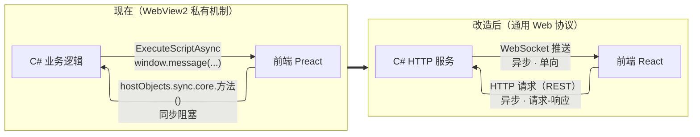

# AGENT.md — IAGD 工作指南

> 面向 AI 编码助手的**对话入口**。新对话读两份即可接上进度：
> **本文件**（稳定的工程背景）+ **[`.docs/00-当前状态.md`](./.docs/00-当前状态.md)**（易变的进度）。
>
> 详细设计内容在 `.docs/`，索引见 [`.docs/README.md`](./.docs/README.md)。

---

## 工程介绍

**iagd**（Grim Dawn Item Assistant）是 ARPG 游戏**恐怖黎明**的第三方工具，
给游戏外挂一个**无限容量的仓库**：把游戏共享箱里的物品"偷"进自己的 SQLite 数据库，
需要时再写回游戏。附带物品检索、收集图鉴、存档备份、好友共享。

### 项目定位

- 本仓库是 **Aa-arun（使用者本人）fork 出来自用魔改的版本**。
- **不必顾虑上游**：不需要兼容 `marius00/iagd`，不考虑 PR、向后兼容或上游代码风格。
- fork 后**尚未做实质改动**。`README.md` 描述的是老架构（CefSharp），是上游忘记更新。

### 使用者背景

- **FPGA 工程师**，熟练 VSCode / Linux，**没有软件开发经验**。
- 本项目兼具**学习软件开发**的目的：
  - 解释概念要从原理出发，术语顺手解释一句。
  - 不确定的地方直接说"不确定"，**不要编造**。
  - 配套教学文档：`.docs/07-教学-软件工程.md`（含课后问题与调研任务）。

### 目标

| 优先级 | 目标 | 状态 |
|---|---|---|
| **P0** | **重做装备显示界面**：提供多种可切换的展示样式 | 设计中 |
| ~~P1~~ | ~~隐藏没用的功能~~ | ✅ 重做即"不实现"，自动解决 |
| ~~P2~~ | ~~美化 WinForms 控件~~ | ✅ 外壳整个去掉，自动消失 |

### ★ 技术路线（已定，2026-09-11）

> **后端服务化 + 系统浏览器访问 + 前端用 React 重做，通信 REST + WebSocket。**
> **WinForms 外壳与 WebView2 最终全部去掉**，只保留托盘图标（`NotifyIcon`）。
>
> - 目标设计：**`.docs/03-目标架构.md`**
> - 实施步骤：**`.docs/05-实施计划.md`**

### 约束

1. **功能行为不能坏**（物品搬运、数据库、游戏解析的结果必须与现在一致），
   但**后端架构可以改**——这正是当前技术路线要做的。
2. **已有数据不能丢**：物品数据库是多年积累。
3. **每步改动都提交 git**，保证可回退。
4. 动手前先看 `.docs/` 对应文档，不要凭猜测改代码。

---

## 工程结构

```
iagd/
├── AGENT.md                 ← 本文件
├── .docs/                   ← ★ 全部设计文档（索引见 .docs/README.md）
├── README.md                ← 上游 README（描述过时：仍写 CefSharp）
├── LINUX.md                 ← 上游的 Linux 运行指南，**本项目用不到**
├── IAGrim-core.sln          ← Visual Studio 解决方案
│
├── IAGrim/                  ← 【主程序】WinForms 外壳 + 全部业务逻辑（.NET 10）
│   ├── Program.cs / StartupService.cs    进程入口与启动编排
│   ├── UI/                  ← WinForms 界面
│   │   ├── MainWindow.cs / .Designer.cs  主窗口（TabControl 外壳）
│   │   ├── Tabs/SplitSearchWindow.cs     ★ Items 页：左过滤面板 + 右 WebView2
│   │   ├── Misc/CEF/                     ★ 前后端桥（名字是历史遗留，实为 WebView2）
│   │   └── Filters/, Popups/, Controller/
│   ├── Database/            ← SQLite + NHibernate：DAO / Model / Dto / Migrations
│   ├── Parsers/             ← 解析游戏数据（Arz）与 transfer 存档
│   ├── Services/            ← 物品分页、属性计算、消息处理
│   └── Backup/, Utilities/
│
├── WebUI/                   ← 【前端】现有实现是 Preact + TS + Vite（将被 React 重做取代）
│   ├── src/components/      ← 组件（App、Header、Item 卡片、提示条）
│   ├── src/containers/      ← 页面级容器（ItemContainer / Collection / Help…）
│   ├── src/integration/     ← ★ 与 C# 通信的唯一出入口
│   ├── src/style/index.css  ← ★ 主题变量（明/暗两套 CSS 变量）
│   └── build.cmd            ← 构建并把产物拷进 IAGrim 的 Resources
│
├── HookDll/                 ← 注入游戏的 DLL
├── DllInjector/             ← 把 DLL 注入游戏进程
├── Parser/ DataAccess/ StatTranslator/ Cloud/ EvilsoftCommons/
└── Installer/ Inno/
```

**命名陷阱**：代码里到处是 `CEF` / `Cef`（`IAGrim.UI.Misc.CEF`、`CefBrowserHandler`），
但**实际用的是 WebView2**。看到 CEF 按 WebView2 理解。

---

## 技术图：前后端通信



**核心设计**：WebSocket 消息**沿用现有枚举编号**（`SetItems`=5、`UpdateItemStats`=9…），
只换传输层、不改语义。详见 `.docs/03-目标架构.md` §4。

**开发时的关键能力**：现有前端在浏览器里跑时 `isEmbedded === false`，走 mock 数据分支，
因此**纯界面工作不需要后端、不需要 Windows**。

---

## 文档规范

- **长文档一律放 `.docs/`**，AGENT.md 只放"每次对话都要知道的短信息"。
- 命名 `.docs/NN-主题.md`，中文内容。`.docs/README.md` 是索引，新增文档要同步。
- **未验证的推测必须标注**：用 `> ⚠️ 待确认：…`，不要写成事实。
- **不要在每个文档末尾记"变更记录"**——那是历史痕迹。重要决策集中记在
  `.docs/05-实施计划.md` 的决策记录里。
- **不要写"原本打算 X，后来改成 Y"**。直接写最终结论 + 一句理由。

---

## 开发环境与依赖

> 详细见 [`.docs/04-开发环境.md`](./.docs/04-开发环境.md)。

**主要环境（计划）**：Windows 主机 + WSL2。

| 依赖 | 用途 | 版本 |
|---|---|---|
| .NET SDK | 编译 IAGrim | **10.0**（Windows 版自带 WinForms 组件） |
| **VS Code + C# Dev Kit** | 写 C#、编译、调试 | ✅ **足够，不需要 Visual Studio** |
| Node.js | 编译前端 | **20 LTS** |
| Git | 版本控制 | 任意较新版本 |
| WebView2 Runtime | 过渡期需要 | 改造后不再需要 |
| （可选）AutoUpdater.NET.dll | 缺失时编译报 CS0246 | 见 `README.md` |

**常用命令**：

```bash
cd WebUI
npm install        # 首次
npm run dev        # Vite 开发服务器，默认 http://localhost:3000
npm run lint       # ESLint
npm run build      # 产出 build/
```

```bat
cd WebUI && build.cmd     REM 构建并拷进 C# 项目（Windows）
dotnet build IAGrim-core.sln
```

**当前这台 Linux 开发机**：不能编译 C#（无 dotnet，且目标是 Windows-only）。
有 Node.js，**可以开始线 A 的步 0、1、4、5**（假数据、纯界面工作）。

---

## 当前进度与下一步

> ★ **动态内容已移到 [`.docs/00-当前状态.md`](./.docs/00-当前状态.md)。**
> 本节只保留稳定的路线概览。

| 线 | 内容 | 需要 |
|---|---|---|
| A | 新前端增量开发（步 0–6） | 步 0 / 1 / 4 / 5 只需 Node.js |
| B | 后端服务化：HTTP + WebSocket 与旧路径并存 | Windows |
| C | 界面迁移：搜索框、过滤器面板搬进网页（**工作量最大**） | Windows |

**动手前必读**：`.docs/03-目标架构.md` + `.docs/05-实施计划.md`。
